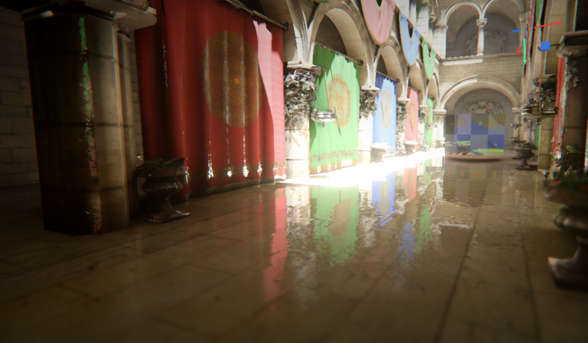
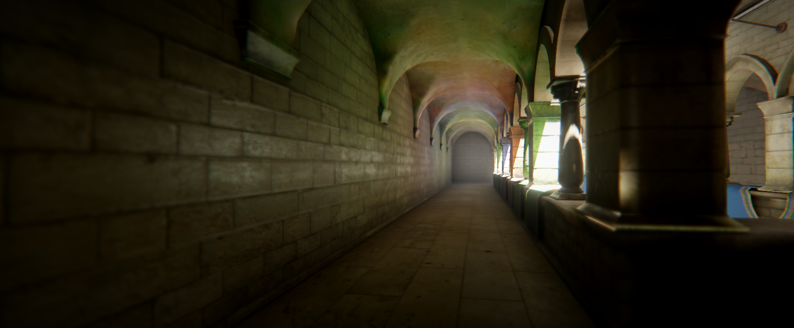

# Prowl 1.0-preview

After 2 years and over 1,300 commits, the New Editor branch has landed on main, and it's official: this is Prowl 1.0-preview, our first proper GitHub Release! This is the single biggest update Prowl has ever had! It's a complete Editor rewrite and redesign, a rebuilt renderer, a much deeper physics feature set, a new audio system, and a handful of brand new first-party packages, nearly every part of the engine got touched. Windows, macOS and Linux are all fully supported now too, both the Editor and exported builds.

Here's just a fraction of whats new:

## Runtime

- Runtime now works standalone from the Editor as a library
- Multi-threaded Asset Streaming
- New Input Action System & Manager
- Unit tests across Runtime and Editor - 450+ tests

## Render Pipeline

A forward renderer rebuilt from scratch, with every shader rewritten from the ground up.

- Point and Spot Lights, all shadow-mapped
- Shadow Atlas, Cascaded Shadow Maps, Point Light (Omni) Shadowmapping, Hardware PCF
- Light Probes and a full Lightmap Generator, baked with Photonic
- Skeletal Animation, Blendshapes, Sub Meshes, GPU Instancing, better batching via IRenderable
- Volumetric Fog and Lighting, Anisotropic Shaders, Translucency, Frustum Culling, Stencil Support, Grab Pass, Motion Vectors
- Cube and 3D Textures
- New Skybox and Fog scene options
- A dedicated Render Thread
- A new Image Effect API driving the post-processing stack: GTAO, AgX, Auto Exposure, Bloom, DOF, Motion Blur, TAA, SSR
- A full visual Shader Graph editor with 100+ nodes
- Custom Forward Algorithm called H-Forward (Hierarchical Forward)

## Editor

A complete Editor rewrite and redesign, top to bottom, new UI built on Origami on top of Paper.

- Themes, Undo/Redo, rebindable hotkeys, Asset Thumbnails
- New Asset Importers: GLTF, FBX, OBJ and VRM, via Clay
- Scene View editors, Prowl Packages (export/import package files), Sub Assets
- Prefabs, with Nested Prefabs
- Localization - En, De, Es, Fr, It, Ja, Ko, Pl, Pt, Ru, Tr, Zh
- Render Stats in the Game View, new Script Templates, rewrote how Default Assets work
- Standalone Builds with per-platform build profiles, Managed and Native Plugins with Assembly Definitions
- Hot-Reloading Scripts, and better script recompilation in general
- Full DPI and non-ASCII text support
- Windows, macOS and Linux support for both the Editor and exported builds

## Packages

A handful of new first-party libraries came out of this effort, and all of them work outside Prowl too:

- Paper - immediate-mode UI framework, with a powerful layout engine, animation/transition engine, and interaction engine
- Quill - vector graphics and text rendering, anti-aliasing, gradients, blurring, an HTML Canvas-like API
- Scribe - TrueType font parsing, glyph rasterization, SDF text, rich text, and markdown layout
- Vector - Complete math library
- Photonic - progressive lightmapper
- And More!

## Physics

- Character Controller
- Volumetric Wheel Collider
- Terrain Collider
- A full set of joints and constraints
- LayerMask support, a Shape Query API, and Triggers

## Audio

- A new effect chain system
- Wav, Mp3, Flac and Ogg support

## GameObject UI

- A full GameObject-based UI system, including World Space UI
- Prowl Actions - much like UnityEvents, but Prowl's own

## And More

- Terrain, with Grass, Trees, and Holes
- Particle System
- Line Renderer
- 3D Text Mesh component
- Sprites

That's the highlight reel, there's a lot more under the hood. Grab the Prowl 1.0-preview release from GitHub Releases and give it a try!
