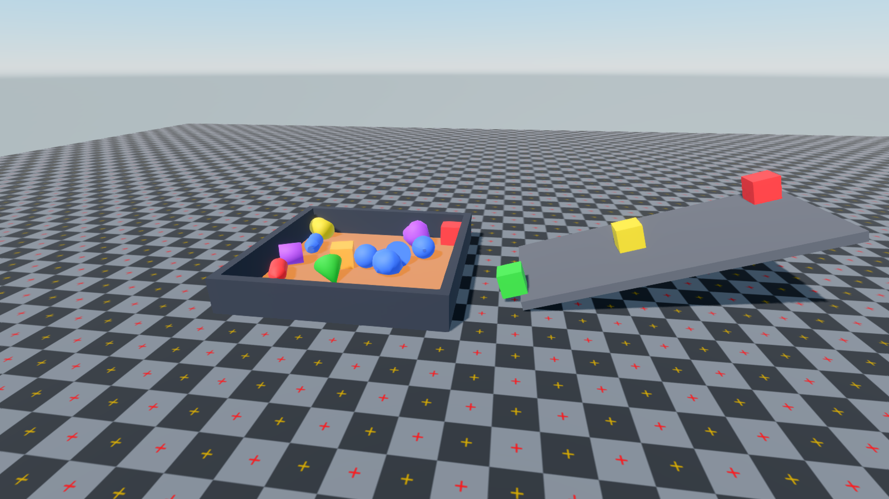

# A little README fanciness

**This is a test post**, created to try the launcher's Markdown reader. These
screenshots come from the bundled Prowl samples; this is a formatting demo.


## Welcome to the devlog

We can archive showcases here with **bold highlights**, *emphasis*,
~~struck out ideas~~ and `inline code`. Visit the
[Prowl repository](https://github.com/ProwlEngine/Prowl) or browse the
[news authoring guide](https://github.com/dimmerly/Prowl-Launcher#news).

> Great showcases deserve a place where people can find them again.
>
> Markdown keeps writing a post as simple as editing a README.

### What an entry can include

- A short introduction and screenshots.
- Details about the work:
    - Rendering and materials.
    - Physics and interaction.
- Links to the original showcase and related discussions.

### Try the samples

1. Open **Samples** in the launcher.
2. Pick a scene to explore.
3. Return here to read about the development work.

---

## Physics in action



### A small code example

```csharp
// A formatting example for a devlog snippet.
public void Update(float deltaTime)
{
    elapsed += deltaTime;
    Console.WriteLine($"Simulation time: {elapsed:0.00}s");
}
```

### Publishing checklist

- [x] Write a Markdown article.
- [x] Add screenshots alongside the article.
- [x] Add its metadata to the index.
- [ ] Replace this test post with a real archived showcase.

#### Smaller heading

Long paragraphs should wrap naturally in the article reader, including when the
launcher window is resized. A mix of prose, images, quotes, code and nested lists
helps check both the layout and the scroll behavior of a longer devlog.

##### One more detail

Images on their own line keep their aspect ratio and fit the available width.
An unavailable image should fall back to its description:


###### End of the test post

Thanks for trying the Markdown reader.
